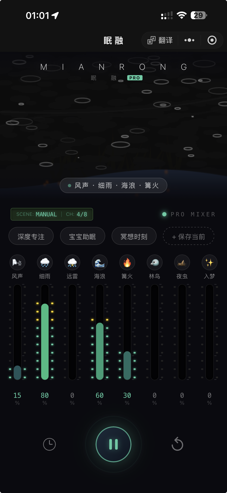

# 眠融 (MianRong) - 专业级白噪音冥想空间

> **沉浸式声学混音器 | 极简主义设计 | 极致交互体验**

一个基于 uni-app 开发的极致白噪音混音器，旨在提供深度的沉浸感与高效的专注体验。



## 💎 PRO 版本核心特性

### 1. 极致简约的“悬浮”布局 (Pure Floating UI)
- **无界设计**：移除了所有背景方块、边框和分割线。调音台控件直接“漂浮”在动态水墨背景之上，营造出一种融于环境的自然感。
- **重心下移**：重新设计的垂直布局，将核心控制区推向屏幕底部，缩短手指操作路径，完美适配大屏手机的单手使用。

### 2. 交互式 8 轨专业调音台
- **纯电平交互**：去除了传统的物理滑块手柄，仅保留纵向彩色电平条。直接在轨道上滑动即可调节音量，视觉反馈丝滑顺畅。
- **独奏模式 (Solo Mode)**：**长按**任意音轨即可触发中等强度触感震动，系统自动将其他音轨静音，聚焦当前音源。

### 3. 多场景智能管理
- **预设场景**：内置“深度专注”、“宝宝助眠”、“冥想时刻”等多种专业混音方案。
- **自定保存**：调好满意的组合后，一键保存为个人场景，支持云端同步样式的手感。

### 4. 情境化功能面板
- **原生时钟图标**：采用纯 CSS 绘制的等宽时钟图标，解决跨平台显示差异，保持 iOS/Android 视觉高度统一。
- **动态倒计时**：开启睡眠定时后，剩余时间实时显示在图标下方，信息获取更直觉，无多余文字干扰。

## 🛠 技术栈

- **框架**: [uni-app](https://uniapp.dcloud.net.cn/) (Vue 3 + TypeScript)
- **平台**: 微信小程序 (mp-weixin) / H5 / App (iOS & Android)
- **核心组件**: 自定义 `MeditationCanvas` (动态视觉层), `AudioCacheManager` (远程加速库)

## 🚀 快速开始

1. **克隆项目**
   ```bash
   git clone https://github.com/zhuyin19890308/whitenoise.git
   ```

2. **开发环境**
   - 推荐使用 [HBuilderX](https://www.dcloud.io/hbuilderx.html) 最新版。
   - 打开项目后，等待 npm 插件自动安装完成。

3. **编译运行**
   - 点击 HBuilderX 顶部 `运行 -> 运行到小程序模拟器`。

---

## 📅 版本更新日志 (v1.0.1)
- [x] **UI 改版**：移除所有冗余背景块与边框，实现 Floating 视觉。
- [x] **交互升级**：移除物理推子块，改为全轨道触控及 Solo 逻辑。
- [x] **品牌重塑**：从“冥想空间”正式更名为“眠 融”。
- [x] **跨平台修复**：自定义 CSS 绘制图标，修复 iOS 字符渲染不一致问题。
